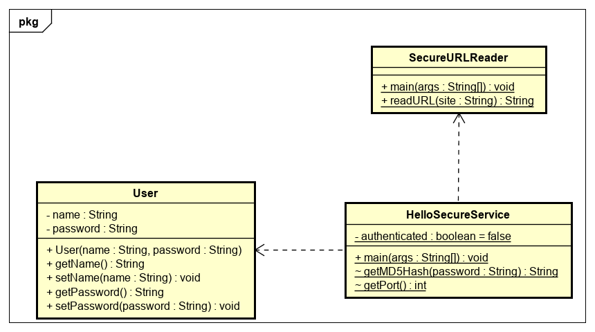
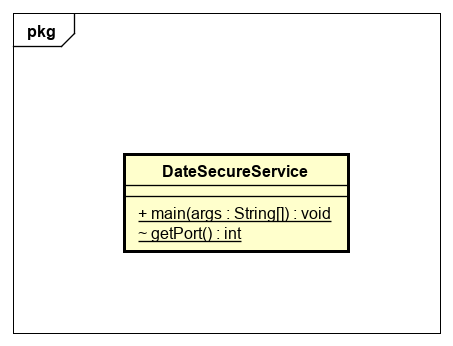
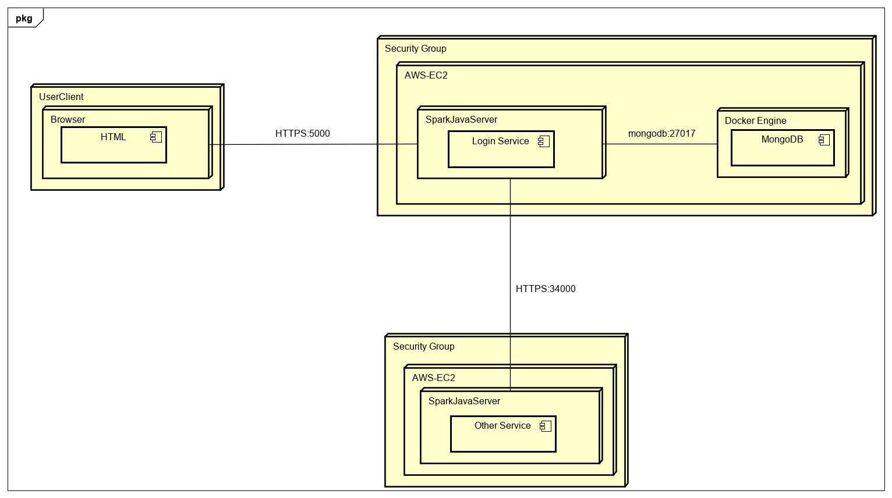
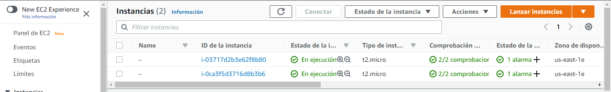
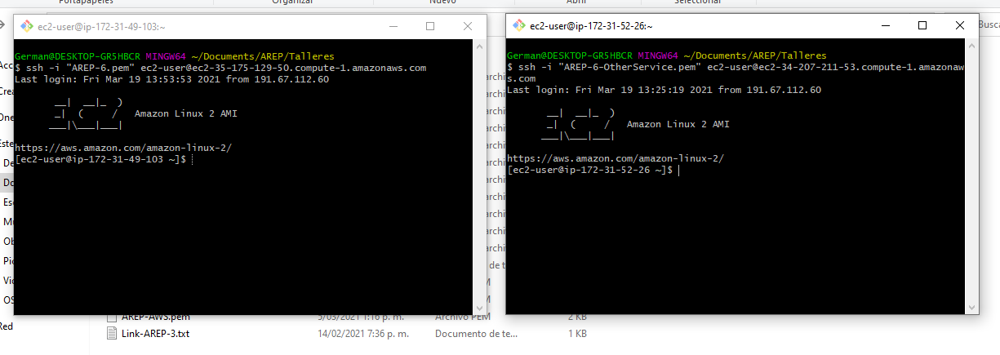
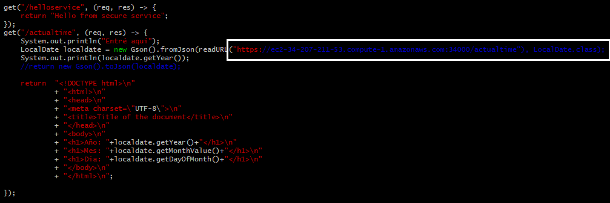
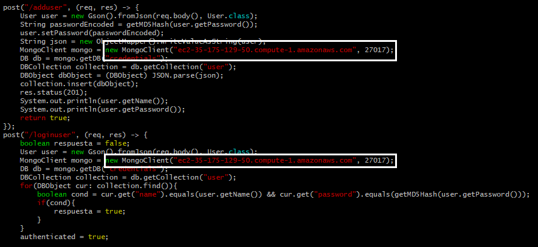
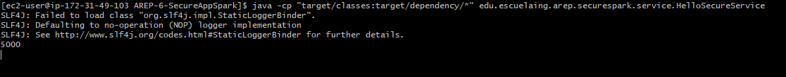
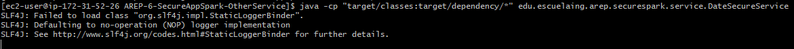
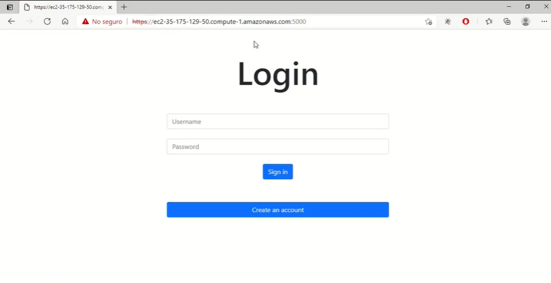

# Taller de Arquitectura Segura
### Pre-requisitos
Para hacer uso del software es necesario tener instalado:
* Java: Como lenguaje de programación                                      
    Siga las instrucciones en https://docs.oracle.com/en/java/javase/15/install/
* Maven: Automatiza y estandariza el flujo de vida de la construcción de software.                 
    Siga las instrucciones en http://maven.apache.org/download.cgi#Installation
* Git: Administrador descentralizado de configuraciones.                     
    Siga las instrucciones en http://git-scm.com/book/en/v2/Getting-Started-Installing-Git
* Docker Desktop: Automatizar el despliegue de aplicaciones dentro de contenedores de software                                   
    Siga las instrucciones en https://www.docker.com/products/docker-desktop
* Keytool de java: Para generar y administrar las llaves y los certificados

### Índice
* [Introducción](#introducción) 
* [Estructura de archivos](#estructura-de-archivos)
    * [Login Service](#login-service)
    * [Other Service](#other-service)
* [Diseño de la aplicación](#diseño-de-la-aplicación) 
    * [Login Service](#login-service-1)
    * [Other Service](#other-service-1)
* [Arquitectura de la aplicación](#arquitectura-de-la-aplicación) 
* [Despliegue de la aplicación](#despliegue-de-la-aplicación)
* [Ejecución de la aplicación](#ejecución-de-la-aplicación)

### Introducción 
La seguridad de la información consiste en proteger los datos y los sistemas de información contra el acceso no autorizado o la modifación de la información en almacenamiento, 
proceso o tránsito, y contra la denegación de servicio a usuarios autorizados. Además, la implementación de sistemas de información debe seguir unos principios de diseño y unas
buenas prácticas para que se minimicen los riesgos de un potencial ataque.                                          
La aplicación desarrollada, garantiza el principio de "Complete mediation" desde los frentes de usuario y servidor. Además, el BackEnd consiste de dos máquinas virtuales EC2 de AWS que alojan un servidor, desarrollado con SparkJava, con los servicios propios de la aplicación. El código fuente de los servicios está disponible en dos repositorios GitHub, uno por cada servicio. Más adelante, se explicará, con mayor detalle técnico, la estructura de archivos, el diagrama de clases y la arquitectura de la aplicación, junto con un
video que muestra la ejecución y la implementación de las medidas de seguridad a la aplicación. 

### Estructura de archivos 
En esta sección se presenta la estructura del directorio src de los dos servicios, el login service y el other service.
#### Login Service 
```
├───src
    ├───main
    │   ├───java
    │   │   └───edu
    │   │       └───escuelaing
    │   │           └───arep
    │   │               └───securespark
    │   │                   ├───connection
    │   │                   ├───model
    │   │                   └───service
    │   └───resources
    │       └───public
    └───test
        └───java
            └───edu
                └───escuelaing
                    └───arep
                        └───securespark
```
#### Other Service
```
├───src
    ├───main
    │   └───java
    │       └───edu
    │           └───escuelaing
    │               └───arep
    │                   └───securespark
    │                       └───service
    └───test
        └───java
            └───edu
                └───escuelaing
                    └───arep
                        └───securespark
```
### Diseño de la aplicación 
A través de dos diagramas de clases, uno por cada servicio, se presenta el diseño de la aplicación
#### Login Service                                                     
                                             
#### Other Service                                           
                                                  
### Arquitectura de la aplicación 

Como se puede apreciar en la imagen, el cliente puede interactuar con el login server a través del cliente web (fachada) que provee este servicio. El servicio principal tambien cuenta con un cliente mongodb para hacer peticiones e inserciones a esta base de datos NoSQL. Se genera una conexión HTTP segura (HTTPS) entre el cliente y LoginService,
a través del puerto 5000, e igualmente entre LoginService y Otherservice, a través del puerto 34000, gracias al uso de KeyStores y Truststores que almacenan las llaves privadas y públicas, respectivamente. Estos almacenes de llaves se crean con la herramienta keytool. 
### Despliegue de la aplicación en EC2
1. Cree dos máquinas virtuales con el servicio EC2 de AWS:

2. Conectese a través de un cliente ssh a cada una de las máquinas utilizando los dos .pem:

3. Clone el repositorio del login service en la primera máquina:
```
git clone https://github.com/germanAOQ/AREP-6-SecureAppSpark
```
4. Clone el repositorio del other service en la segunda máquina:
```
git clone https://github.com/germanAOQ/AREP-6-SecureAppSpark-OtherService
```
5. En la primerá máquina acceda al repositorio ya clonado y modifique la linea en donde se solicita la ip o el dns de la segunda máquina, esto para consumir 
el servicio REST de other service. Adicionalmente, si ya tiene una base de datos mongodb desplegada, modifique la dirección y el puerto del cliente mongo:


6. Compile los dos proyectos desde la raiz de estos:
```
mvn clean install
```
7. Inicie el primer servidor en la raiz del proyecto:

```
java -cp "target/classes:target/dependency/*" edu.escuelaing.arep.securespark.service.HelloSecureService
```
8. Inicie el segundo servidor en la raiz del proyecto:

```
java -cp "target/classes:target/dependency/*" edu.escuelaing.arep.securespark.service.DateSecureService
```
9. Ingrese con el dns del primer servidor y el puerto 5000 a la fachada de la aplicación


### Ejecución de la aplicación 
https://youtu.be/0SN1-E1yA8Y

## Construido con 
* [Maven](https://maven.apache.org/) - Manejador de dependencias
* [Git](https://github.com/) - Control de versionamiento
* [Docker](https://www.docker.com/) - Administrador de contenedores 
* [EC2](https://aws.amazon.com/es/ec2/) - Plataforma de despliegue
* [Circle CI]() - Integración Continua

## Autores 
* [Germán Andrés Ospina Quintero](https://github.com/germanAOQ)

## Licencia 📄
Este proyecto esta licenciado por GNU General Public License v3.0
